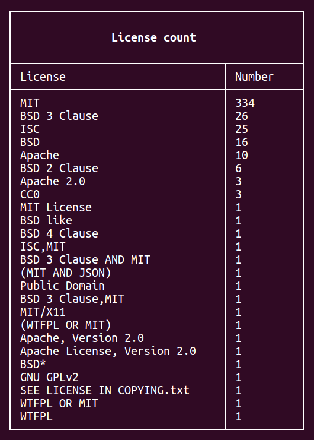
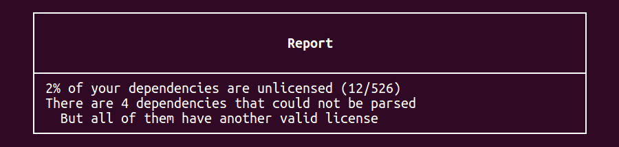

# Legally - check your licenses

> Note: I am not a lawyer and this is not legal advice

Discover the license of the npm packages that you are using easily: Just install it globally and run it in your project folder:

```bash
npm install legally -g
legally
```

It will display first those node_modules' licenses:


And then the license count in your project (different example from the one above):



Finally, you will get a small report stating whether everything is correct or not:




## Documentation

There are a couple of special cases:

- `-`: the file where we are trying to locate the license couldn't be found, or the license itself couldn't be found.

- `? verify`: the license file *was* found and there's strong suggestions that there might be a license, but we just couldn't parse it automatically.


## FAQ

**It says `'No modules installed'`**

Make sure that you are in the root folder for your project; doing `ls` you should be able to see `node_modules`


**Does it check all modules by npm?**

Yes, it will check all of the modules in `node_modules` and the nested ones except for `.bin`.


**What licenses does it check?**

It attempts to find Apache, BSD (2 and 3 Clause), CC0, ISC and MIT. This list *is* short, so please feel free to expand it adding a new file in `/licenses`:

```js
// File /licenses/mit.js
module.exports.name = 'MIT';
module.exports.regex = /(?:The )?MIT(?: (L|l)icense)/;
module.exports.text = `
  Permission is hereby granted, free of charge, to any person obtaining a copy
  ...
  furnished to do so, subject to the following conditions:

  The above copyright notice and this permission notice shall be included in
  all copies or substantial portions of the Software.
`;
module.exports.fragments = module.exports.text.split(/\n\n/);
```
