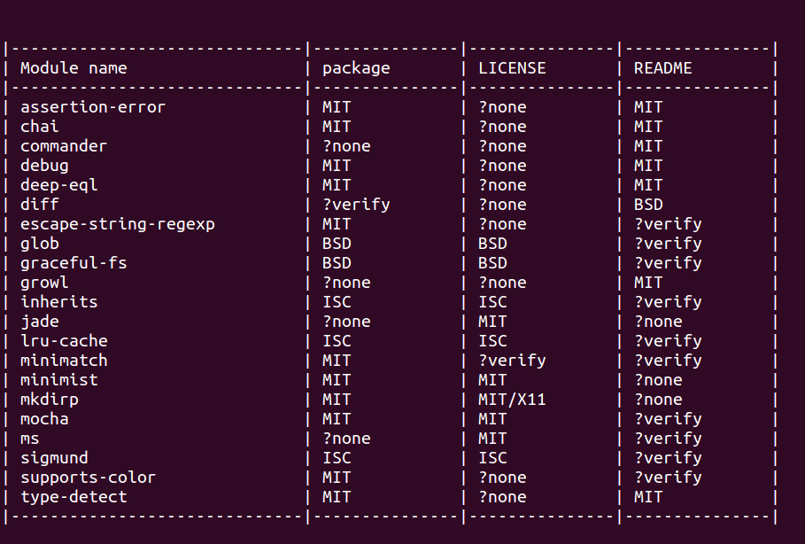

# IANAL - check your dependencies licenses

> Note: I am not a lawyer and this is not legal advice

Discover the license of the npm packages that you are using easily: Just install it globally and run it in your project folder:

```bash
npm install ianal -g && ianal
```




## Documentation

There are few flags that show extra information. These start by **`?`** and are shown instead of the license name:

`?none`: the file where we are trying to locate the license couldn't be found, or the license itself couldn't be found.

`?verify`: the license file *was* found and there's strong suggestions that there might be a license, but we just couldn't pare it automatically.

`?multiple` [not yet]: there are several licenses in this file/module.


## FAQ

**It says `'No modules installed'`**

Make sure that you are in the root folder for your project; doing `ls` you should be able to see `node_modules`


**Does it check all modules by npm?**

Not exactly, it does check all of the modules in `node_modules` except those that start by `.`, but it doesn't go deep checking sub-modules


**What licenses does it check?**

It attempts to find MIT, BSD and ISC, and then there's a regex that attempts to find other licenses automatically. This list *is* short, so please feel free to expand it:

```js
var licenseRegex = [
  
  // Some defaults with non-capturing groups (?:)
  { name: 'MIT', regex: /(?:The )?MIT(?: (L|l)icense)/ },
  { name: 'BSD', regex: /(?:The )?BSD(?: (L|l)icense)/ },
  { name: 'ISC', regex: /(?:The )?ISC(?: (L|l)icense)/ },
  
  // This will attempt to capture the name and display it
  { name: false, regex: /(?:The )?([\w-/\.]{3,}?) (L|l)icense/ }
];
```

Another idea is that we could add a part of the license text to the regex, so the match is more 'secure'. It works pretty well for my purposes right now though.