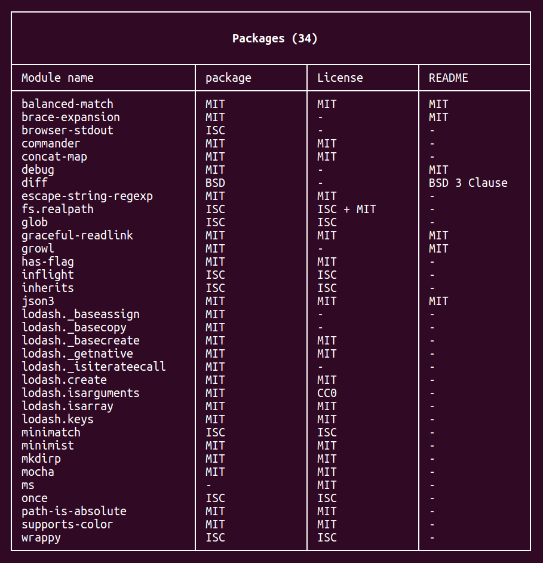
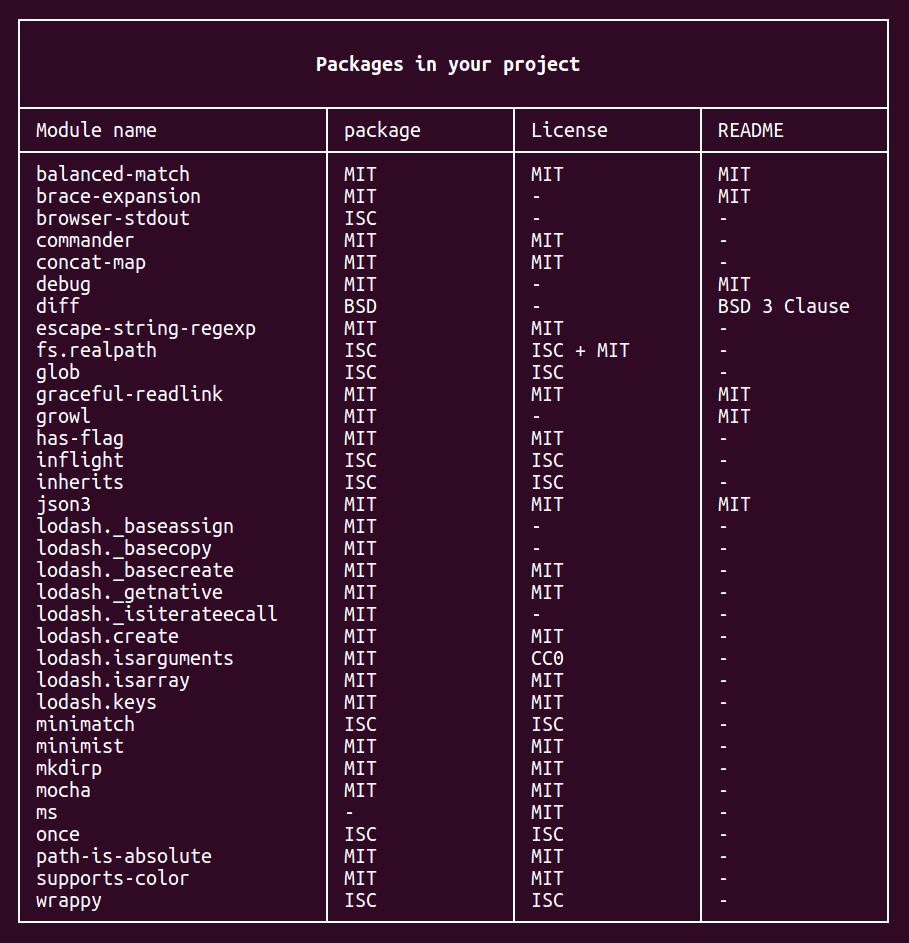
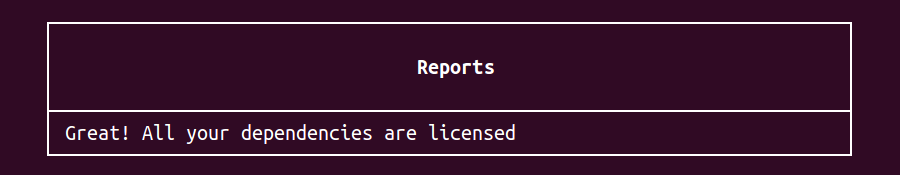
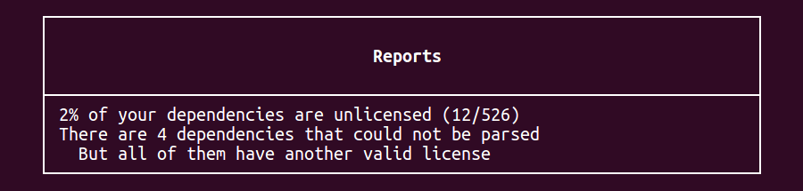
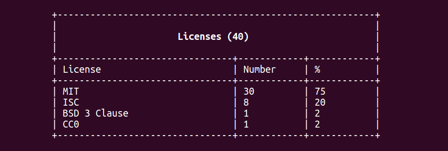

# Legally - check your licenses

> Disclaimer: I am not a lawyer and this is not legal advice

Discover the license of the npm packages that you are using easily: Just install it globally and run it in your project folder:

```bash
npm install legally -g    # Better keep legally global
cd ./YOUR_PROJECT_NAME
legally
```

It will display first those node_modules' licenses:



> `-` means the license couldn't be found and `? verify` that it was found but couldn't be parsed

And then the license count in your project (different example from the one above):



Finally, you will get a small report stating whether everything is correct or not:






## Documentation

The plain command will perform an analysis in-depth of your installed packages and report everything, and that's likely all that you will need:

```bash
legally
```


### Remote packages

You could want to check the licenses for a library before installing it. You can check any remote package (here checking `express`) by doing:

```bash
legally express
```

It will take a while since it has to download it and its dependencies and then it will perform the same analysis as if it was the only package in your repository. You can also check many at the same time:

```bash
legally express body-parser formidable
```


### Selective analysis

To show only a part of the analysis, pass the name of the part that you want to show

```bash
# List of packages and their licenses
legally -packages

# Breakdown of what licenses your dependencies have
legally -licenses

# Overview with actionable points
legally -reports
```


### Styles

You can change the style of the table with the `--border` option. Try the `ascii` option if the table is not displayed correctly by default:

```bash
legally --border thin
legally --border bold
legally --border double
legally --border ascii  # This will work in most systems
```




## FAQ

**It says `'No modules installed'`**

Make sure that you are in the root folder for your project; doing `ls` you should be able to see `node_modules`


**I have more licenses than dependencies**

That could happen. While we only account for one license type per project, a project can have (and many do it) several licenses at the same time.

In the Packages table, you can see this is indicated with a `+`. For example, `JSONStream` has these licenses [parsed out of `package.json`](https://github.com/dominictarr/JSONStream/blob/master/package.json#L10): `MIT + Apache 2`


**Does it check all modules by npm?**

Yes, it will check all of the modules in `node_modules` and the nested ones except for folders starting with `.`.


**What licenses does it check?**

It attempts to find Apache, BSD (2 and 3 Clause), CC0, ISC and MIT. It will also attempt to clean existing ones. The list *is* short, so please feel free to expand it adding a new file in `/licenses`:

```js
// File /licenses/mit.js
module.exports.name = 'MIT';
module.exports.regex = /(?:The )?MIT(?: (L|l)icense)/;
module.exports.text = `
  Permission is hereby granted, free of charge, to any person obtaining a copy
  ...
  furnished to do so, subject to the following conditions:

  The above copyright notice and this permission notice shall be included in
  all copies or substantial portions of the Software.
`;
module.exports.fragments = module.exports.text.split(/\n\n/);
```
